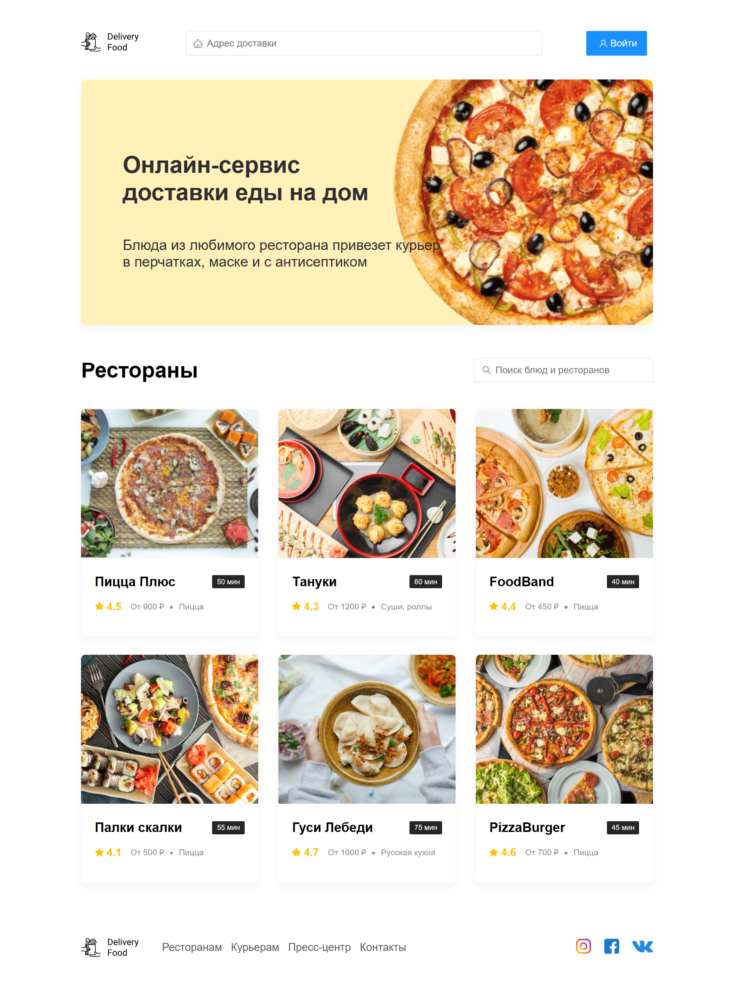
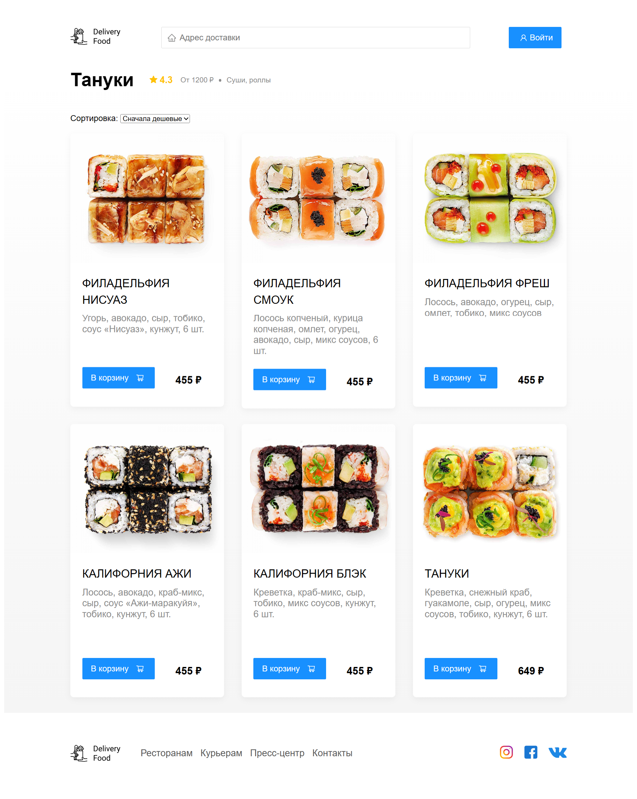
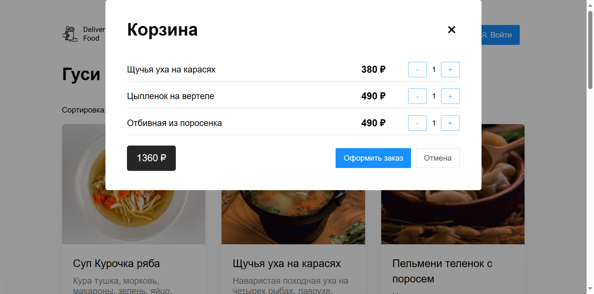
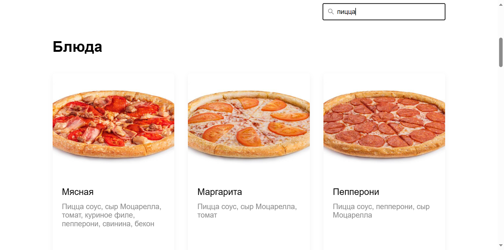

# Restaurants

## Project setup

```
npm install
```

### Compiles and hot-reloads for development

```
npm run serve
```






### Данное веб-приложение, разработанное с использованием Vue.js, предоставляет следующий набор ключевых функциональных возможностей:

### Выбор Ресторанов: Пользователи могут выбирать рестораны из списка, ознакамливаясь с основной информацией, такой как название, рейтинг, тип кухни и время доставки.

### Меню Блюд: Приложение предоставляет доступ к меню каждого ресторана, позволяя пользователям просматривать блюда, их описания и стоимость.

### Корзина Заказов: Пользователи могут собирать заказы, добавляя блюда в корзину, где отображается общая сумма заказа. Также есть возможность управлять заказом, изменяя количество или удаляя блюда.

### Поиск и Фильтрация: Для удобства поиска предусмотрена функция поиска по названию блюд или ресторанов. Пользователи могут также сортировать блюда по цене для выбора оптимальных вариантов.

### Интерактивный Интерфейс: Веб-приложение обладает интуитивно понятным и интерактивным интерфейсом с применением анимаций и переходов между разделами.

### Compiles and minifies for production

```
npm run build
```

### Lints and fixes files

```
npm run lint
```

### Customize configuration

See [Configuration Reference](https://cli.vuejs.org/config/).
